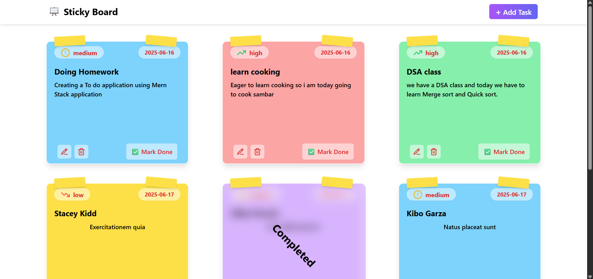
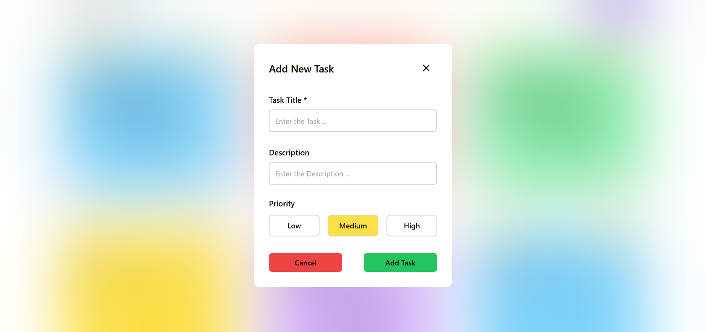
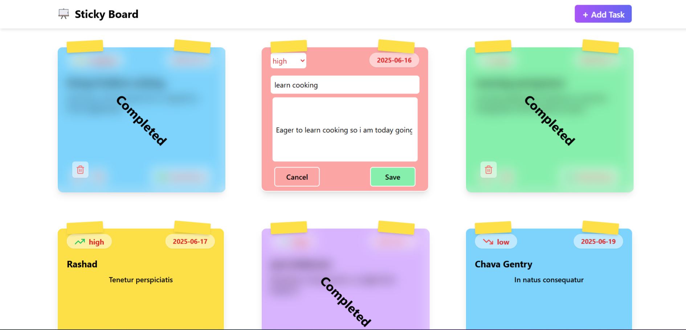

# 📝 Sticky Board - To-Do Application
- Sticky Board is a simple and intuitive web application to help you organize your daily tasks and notes like sticky notes on a digital board. Perfect for productivity lovers!

---

## 🚀 Features

- ✅ Add, edit, and delete tasks
- 📌 Sticky note style layout
- 💾 Data persistence (Local Storage or DB)
- 📱 Fully responsive design

---

## 📸 Screenshots

---

## 🛠️ Tech Stack

- **Frontend:** React.js & Tailwind CSS
- **Backend:**  Express.js
- **Database:** MongoDB
- **Others:** Tanstack - query 
---
